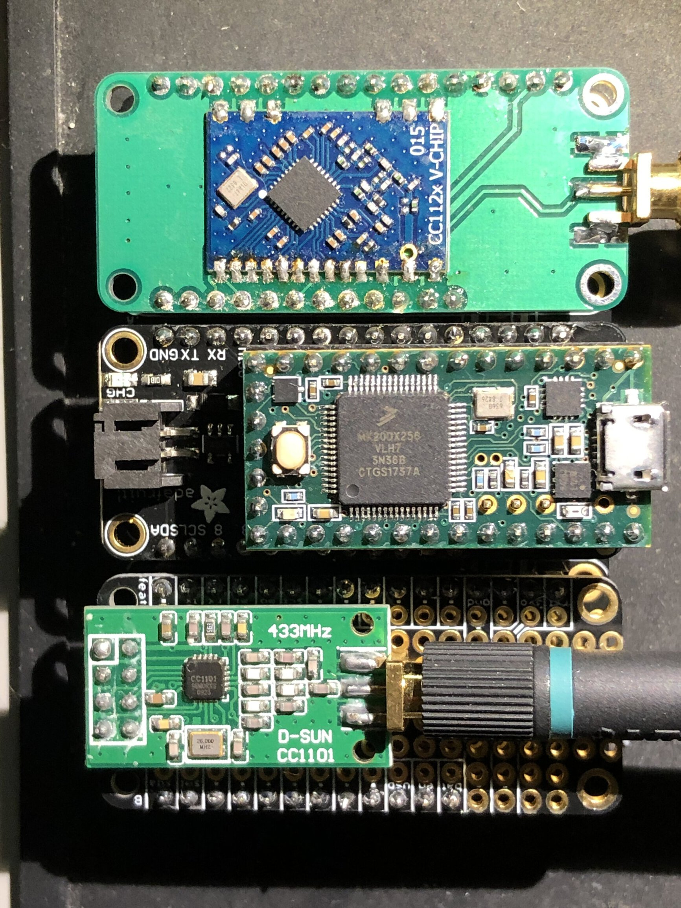

RFQuack is the versatile RF-analysis tool that quacks! It's a library firmware
that allows you to sniff, manipulate, and transmit data over the air. And if
you're not happy how the default firmware functionalities, we made it easy to
extend. Consider it as the hardware-modular and developer-friendly version of
the great [YardStick One](https://greatscottgadgets.com/yardstickone/), which
is based on the CC1111 radio chip. Differently from that and other RF dongles,
RFQuack is designed to be agnostic with respect to the radio chip. So if you
want to use, say, the RF69, you can do it. If you need to use the CC110L or
CC1120, you can do it. Similarly to RFCat, RFQuack has console based, Python
scriptable, client that allows you to set parameters, receive, transmit, and so
on.

We assume you know what you're doing 🤓


# Community
* Slack team: https://join-rfquack-slack.herokuapp.com
* Twitter: https://twitter.com/rfquack

# Table of Contents
* [Another RF-analysis Dongle?](#another-rf-analysis-dongle)
* [Quick Start Usage](#quick-start-usage)
  * [Prepare Your Hardware](#prepare-your-hardware)
  * [Install via Docker](#install-via-docker)
  * [Install from source](#install-from-source)
  * [Test it](#test-it)
* [Interact with the RFQuack Hardware](#interact-with-the-rfquack-hardware)
* [Architecture](#architecture)
* [Modules](#modules)
  * [Radio Module](#radio-module)
    * [Modem configuration](#modem-configuration)
    * [Transmit and Receive](#transmit-and-receive)
    * [Register Access](#register-access)
  * [Packet Filtering Module](#packet-filtering-module)
  * [Packet Modification Module](#packet-modification-module)
  * [Other Modules](#other-modules)
* [Publications](#publications)
* [License (GPLv2)](#license)

# Another RF-analysis Dongle?
Not really. RFQuack is midway between software-defined radios (SDRs), which offer great
flexibility at the price of a fatter code base, and RF dongles, which offer
great speed and a plug-and-play experience at the price of less flexibility
(you can't change the radio module).

RFQuack is unique in these ways:

* It's a **library** firmware, with many settings, sane defaults, and rich logging and debugging functionalities.
* Supports **multiple radio chips**: nRF24, CC1101, basically all the chips supported by [RadioLib](https://github.com/jgromes/RadioLib), and we're adding more.
* Does not require a **wired connection** to the host computer: the serial port is used only to display debugging messages, but the interaction between the client and the node is over TCP using WiFi (via Arduino WiFi) and GPRS (via [TinyGSM](https://github.com/vshymanskyy/TinyGSM) library) as physical layers.
* The IPython client allows both **high- and low-level operations**: change frequency, change modulation, etc., as well as to interact with the radio chip via registers.
* The firmware and its API support the concept of **packet-filtering** and **packet-modification rules**, which means that you can instruct the firmware to listen for a packet matching a given signature (in addition to the usual sync-word- and address-based filtering, which normally happen in the radio hardware), optionally modify it right away, and re-transmit it.

So, if you need to analyze a weird RF protocol with that special packet format
or that very special modulation scheme, with mixed symbol encodings (yes, I'm
looking at you, CC1120 in 4-FSK mode 🤬), with RFQuack you just swap the radio
shield and you can just start working right away. And if we don't support that
special radio chip, you can just craft your shield and add support to the software!

# Quick Start Usage
RFQuack is quite experimental, expect glitches and imperfections. So far we're quite happy with it, and used it successfully to analyze some industrial radio protocols (read the [Trend Micro Research white paper](https://www.trendmicro.com/vinfo/us/security/news/vulnerabilities-and-exploits/attacks-against-industrial-machines-via-vulnerable-radio-remote-controllers-security-analysis-and-recommendations) or the [DIMVA 2019 paper](https://www.dimva2019.org) for details).

## Prepare Your Hardware
* choose radio chip and the board you want to use among the supported ones: we tested it with the CC1101, nRF24 and ESP832-based boards (namely the Adafruit Feather);
* assemble the board and the radio chip together: if you choose the Adafruit Feather system, all you have to do is stack the Feather HUZZAH and the Radio FeatherWing together, and do some minor soldering;
* connect the board to the USB port.

| **Main board** | **Radio daughter board** | **Network connectivity** | **Cellular connectivity** |
|----------------|-------------------------------------|----------------------|-----------------------|
| Feather HUZZAH32 | Feather nRF24 | ESPWiFi | Not tested |
| Feather HUZZAH32 | Feather CC1101 | ESPWiFi | Not tested |
| Feather FONA | Radio FeatherWing RFM69HW 433 MHz | None | Tested with early versions of RFQuack |

You could play around with other combinations, of course. And if you feel generous, you can fork this repository, add support for untested hardware, and send us a pull request (including schematics for new daughter-boards)! 👏



## Install via Docker
The quickest way to get started is by mean of our Docker image. It will automatically build and upload the code to any supported board.
* Make sur you have [Docker](https://docs.docker.com/get-started/) installed.
* Run the docker container, it'll upload RFQuack to any connected board. Use the cheat sheet and look for your configuration:

| **Command**    | **Description**           |
|----------------|---------------------------|
|`docker run --device=/dev/ttyUSB0:/board -e BOARD=HUZZAH32 -e RADIOA=CC1101 -e RADIOA_CS=2 -e RADIOA_IRQ=5 --rm -it rfquack/rfquack` | Uploads RFQuack to an `Adafruit HUZZAH32` (`/dev/ttyUSB0`), connected to a `CC1101` (`Chip Select` on PIN2, `GDO0` on PIN5) |
|`docker run --device=/dev/ttyUSB0:/board -e BOARD=HUZZAH32 -e RADIOA=nRF24  -e RADIOA_CS=5 -e RADIOA_IRQ=4 -e RADIOA_CE=2 --rm -it rfquack/rfquack` | Uploads RFQuack to an `Adafruit HUZZAH32` (`/dev/ttyUSB0`), connected to a `nRF24` (`Chip Select` on PIN5, `IRQ` on PIN4, `Chip Enable` on PIN2) |

   Please, change the CS, IRQ and CE pins according to your wiring. ([More about container's variables](#docker-container))
* Done :smile: RFQuack is installed on your hardware and reachable via *serial*. It's time to [test it!](#test-it)

## Install from Source
RFQuack comes in the form of a firmware *library*, which means that you need to write your own "main" to define a minimum set of parameters. Don't worry, there's not much to write in there, and we provide a [few working examples](https://github.com/trendmicro/RFQuack/tree/RadioLib/examples).

* Checkout this repository: `git clone https://github.com/trendmicro/RFQuack.git`
* Make sure you have `platformio` and `protoc` installed.
* Install `Nanopb 0.3.9.2` using `platformio lib -g install git+https://github.com/nanopb/nanopb.git#0.3.9.2`
* Enter the main directory: `cd RFQuack`
* Generate protobuf implementations: `make proto`
* Install the RFQuack library via `platformio lib -g install file://./` (if you want to install it globally)

  **NOTE** Platformio will *copy* the library to its internal storage. Any change to sources will not be reflected.
* To talk to your RFQuack dongle, you have two options:
  * **MQTT Transport (and hardware serial console):** install or have access to an MQTT broker (Mosquitto is just perfect for this):
    * PROs:
      * you don't need cables (hint: your RFQuack hardware can be battery powered)
      * if you want to connect the RFQuack hardware to your computer, you get a free (hardware) serial console for monitoring on the USB port
    * CONs:
      * you need network connectivity (WiFi or cellular)
      * there's latency
  * **Hardware Serial Transport (and software serial console):** connect the dongle via USB
    * PROs:
      * there's little latency
      * you don't need to rely on network stability
    * CONs:
      * if you want full monitoring and debugging capabilities, you'll need to hookup a UART cable to the RFQuack hardware (by default, a software serial device is used, and will write on pins 16, 12 (RX, TX); this can be changed by defining `RFQUACK_LOG_SS_RX_PIN` and `RFQUACK_LOG_SS_TX_PIN` before `#include <rfquack.h>`)
      * your range is limited by the length of your USB cable (you don't say! 😮)
* configure the firmware: best if you use one of the proposed examples.

## Test it
* If you choose the *MQTT* transport (instead of the *serial* one), fire up the MQTT broker (hint: use `mosquitto -v` so you'll see debug messages).
* you should now see something like this (if it's not 100% the same, and if you get garbled output at the beginning, it's OK)

```
$ platformio device monitor --baud 115200 --port <YOUR SERIAL MONITOR PORT>

{$␀lܟ|␀�$�|␂␌␄␌�␄l�␄c<��b��'o�␀d��l`␃�␛␓no␌d`␃␇␃o;���o␌␄#␌�␇l␇s��g␄␌c␄�␏d�␛l

rst:0x1 (POWERON_RESET),boot:0x17 (SPI_FAST_FLASH_BOOT)
configsip: 0, SPIWP:0xee
clk_drv:0x00,q_drv:0x00,d_drv:0x00,cs0_drv:0x00,hd_drv:0x00,wp_drv:0x00
mode:DIO, clock div:2
load:0x3fff0018,len:4
load:0x3fff001c,len:1044
load:0x40078000,len:8896
load:0x40080400,len:5828
entry 0x400806ac
[RFQK]        138 T: Standalone mode network setup: done!
[R�␀␀␀␀␀␀␀␀␀␀␀␀␀␀␀␀␀␀␀␀␀␀␀␀␀␀␀␀␀␀␀␀␀␀␀␀␀␀␀␀␀␀␀␀␀␀␀␀␀␀␀␀␀␀␀␀␀␀␀␀␀␀␀␀␀␀␀␀␀␀␀␀␀␀␀␀␀␀␀␀␀␀␀␀␀[RFQK]        464 T: Serial transport connected
[RFQK]        565 T: Serial transport connected
[RFQK]        876 T: Module 'frequency_scanner' registered.
[RFQK]        876 T: Module 'mouse_jack' registered.
[RFQK]        876 T: Module 'packet_filter' registered.
[RFQK]        879 T: Module 'packet_modification' registered.
[RFQK]        885 T: Module 'packet_repeater' registered.
[RFQK]        890 T: Module 'roll_jam' registered.
[RFQK]        894 T: Module 'radioA' registered.
[RFQK]        898 T: Setup is over.
[RFQK]        912 T: Starting main loop.
```

Conversely if you get something like:

```
[RFQK]        138 T: Standalone mode network setup: done!
[R␆␀␀␀␀␀␀␀␀␀␀␀␀␀␀␀␀␀␀␀␀␀␀␀␀␀␀␀␀␀␀␀␀␀␀␀␀␀␀␀␀␀␀␀␀␀␀␀␀␀␀␀␀␀␀␀␀␀␀␀␀␀␀␀␀␀␀␀␀␀␀␀␀␀␀␀␀␀␀␀␀␀␀␀␀␀[RFQK]        465 T: Serial transport connected
[RFQK]        565 T: Serial transport connected
[RFQK]        767 E: Unable to initialize radio, got code -16
[RFQK]        767 T: Something went wrong, check your wiring.
```

This is probably due to a faulty wiring, check your connections and the pin you configured as `CS`.


# Interact with the RFQuack Hardware
Now you can use RFQuack via the IPython shell. We highly recommend tmux to keep an eye on the output log.

You need to install the [RFQuack CLI package](https://github.com/rfquack/RFQuack-cli). For the sake of simplicity we'll run it through Docker:

```bash
$ docker run --rm -it rfquack/cli --help
Usage: rfquack [OPTIONS] COMMAND [ARGS]...

Options:
  -l, --loglevel [CRITICAL|ERROR|WARNING|INFO|DEBUG|NOTSET]
  -h, --help                      Show this message and exit.

Commands:
  mqtt  RFQuack client with MQTT transport.
  tty   RFQuack client with serial transport.
```

```bash
$  docker run --rm -it rfquack/cli mqtt --help
Usage: rfquack mqtt [OPTIONS]

  RFQuack client with MQTT transport. Assumes one dongle per MQTT broker.

Options:
  -i, --client_id TEXT
  -H, --host TEXT
  -P, --port INTEGER
  -u, --username TEXT
  -p, --password TEXT
  -h, --help            Show this message and exit.
```

```bash
$ docker run --rm -it rfquack/cli tty --help
Usage: rfquack tty [OPTIONS]

  RFQuack client with serial transport.

Options:
  -b, --baudrate INTEGER
  -s, --bytesize INTEGER
  -p, --parity [M|S|E|O|N]
  -S, --stopbits [1|1.5|2]
  -t, --timeout INTEGER
  -P, --port TEXT           [required]
  --help                    Show this message and exit.
```

More concretely:

```bash
$ docker run --device /dev/ttyUSB0 --rm -it rfquack/cli tty -P /dev/ttyUSB0
2019-04-10 18:04:31 local RFQuack[20877] INFO Transport initialized
2019-04-10 18:04:31 local RFQuack[20877] INFO Transport pipe initialized (QoS = 2): mid = 2

...

RFQuack(/dev/ttyUSB0, 115200,8,N,1)> q.radioA.set_modem_config(modulation="OOK", carrierFreq=434.437)

result = 0
message = 2 changes applied and 0 failed.

RFQuack(/dev/ttyUSB0, 115200,8,N,1)> q.radioA.rx()

result = 0
message =
...

```

At this point you're good to go from here!


# Architecture


RFQuack has a modular software and hardware architecture comprising:

* a radio chip (usually within a module)
* a micro-controller unit (MCU)
* an optional network adapter (cellular or WiFi)

The communication layers are organized as follows:

* The Python client encodes the message for RFQuack with Protobuf (via [nanopb](https://github.com/nanopb/nanopb)): this ensures data-type consistency across firmware (written in C) and client (written in Python), light data validation, and consistent development experience.
* The serialized messages are transported over MQTT (which allows multi-node and multi-client scenarios) or serial (when you need minimal latency).
* The connectivity layer is just a thin abstraction over various cellular modems and the Arduino/ESP WiFi (or simply serial).
* The message is decoded and handled by a software [module](#modules)

# Modules
RFQuack's functionalities are built as pluggable modules, developed on top of a generic API.
When you fire up the Python shell, you can interact with the connected dongle through the `q` object; try auto-completion *(tab is your friend)* and discover each loaded module.

Each module has a built-in, super handy, helper function:
```python
RFQuack(/dev/ttyUSB0, 115200,8,N,1)> q.frequency_scanner.help()  

Helper for 'frequency_scanner' module:
> q.frequency_scanner.freq_step
Accepts: rfquack_FloatValue
Frequency step in Mhz (default: 1)

> q.frequency_scanner.start()
Accepts: rfquack_VoidValue
Starts frequency scan

...
```

For sure, you already understood how it works:
* `q.frequency_scanner.freq_step` is a `float` property; you are free to **get** it:
```python
RFQuack(/dev/ttyUSB0, 115200,8,N,1)> q.frequency_scanner.freq_step
value = 1.0
```

or **set** it:


```python
RFQuack(/dev/ttyUSB0, 115200,8,N,1)> q.frequency_scanner.freq_step = 5.0
result = 0
message =
```

* While `q.frequency_scanner.start()` is a `function(void)` :
```python
RFQuack(/dev/ttyUSB0, 115200,8,N,1)> q.frequency_scanner.start()
result = 0
message = Nothing detected
```

That's all :smile:

If unsure which parameters a function/property can take please check the `src/rfquack.proto` protocol definition. Since we're using reflection, IPython can't offer completion here (if you know a way to have completion on dynamic attributes, please let us know!).

In the following, we explore the main functionalities of each - built in - module through some examples.

## Radio Module
Each connected radio will pop up as a module, progressively named after `radioA`, `radioB`, `radioC`, `radioD`, `radioE`.

RFQuack's radio sub-system is based on [RadioLib](https://github.com/jgromes/RadioLib), so for most aspects you can refer to the RadioLib documentation. (yep, even for error codes :smile:)

### Modem Configuration
Not all radio modules support modem configuration. Sub-gigahertz modems usually do. The `q.radioA.set_modem_config()` function takes as argument a `rfquack_ModemConfig`, which is built of the following - optional - parameters:

* `carrierFreq`: this is the carrier frequency, easy; make sure you comply to the radio module you chosen.
* `txPower`: control the transmission power; set them wisely and make sure to follow the laws that apply to your country.
* `preambleLen`: control the length of the radio's preamble.
* `syncWords`: sync-word matching is a basic functionality of most packet-radio modules, which allow to efficiently filter packets that match the sync words and just ignore the rest, in order to keep the radio chip and the MCU busy only when an expected packet is received; depending on the radio module, the sync words can be set to zero (promiscuous mode) or up to a certain number of octects (e.g., 4); in promiscuous mode, the radio and MCU will be *very* busy, because they will pick up *everything*, including noise.
* `isPromiscuous`: handy way to automatically set neat parameters and enter a fully *promiscuous* mode: sets syncword, disable crc filtering, disables automatic acknowledges, ...
* `modulation`: this is the carrier modulation (ASK, OOK, FSK, GSK ...); make sure you comply to the radio module you chosen.
* `useCRC`: whatever to enable or disable CRC filtering.
* `bitRate`: this is the symbol bitrate (in kbps); make sure you comply to the radio module you chosen.
* `rxBandwidth`: Sets receiver bandwidth (in kHz); make sure you comply to the radio module you chosen.

Usage example (on a `CC1101` radio):

```python
RFQuack(/dev/ttyUSB0, 115200,8,N,1)> q.radioA.set_modem_config(modulation="OOK",
                                                              carrierFreq=434.437,
                                                              bitRate=3.41296,
                                                              useCRC=False,
                                                              syncWords=b"\x99\x9A",
                                                              rxBandwidth=58)
result = 0
message = 6 changes applied and 0 failed.
```

It's not over :stuck_out_tongue:

Usually, radios receive and transmit *packets*. You can set the radio to expect a *fixed length* packet or, if it's supported, you can ask the radio to look for the packet length in the payload itself. All of this can be done using the `set_packet_len` function.

Usage example (on a `CC1101` radio):

```python
RFQuack(/dev/ttyUSB0, 115200,8,N,1)> q.radioA.set_packet_len(isFixedPacketLen=True, packetLen=102) # Sets len to 102 bytes.
result = 0
message =
```

### Transmit and Receive
The `tx()`, `rx()`, `idle()` functions are self-explanatory: they set the module in transmit, receive and idle mode, respectively. To actually transmit data, you can use `send(data=b"\xAA\xBB")`, where data must be a list of raw octect values; there's a limit in the length, which is imposed by the radio module, so make sure you check the documentation.

```python
RFQuack(/dev/ttyUSB0, 115200,8,N,1)> q.radioA.tx() # Enters TX mode.
result = 0
message =

RFQuack(/dev/ttyUSB0, 115200,8,N,1)> q.radioA.send(data=bytes.fromhex("555555d42d"))
result = 0
message =
```

By default, a packet is transmitted only once. If you want to repeat it, just set `repetitions` to whatever you want, and RFQuack will repeat the transmission as fast as possible (bound by the MCU clock, of course).

### Register Access
While RadioLib has gone very far in abstracting the interaction with the radio,

Some radio chips are really "unique," so to speak. In these cases, the only option is to grab a large cup of your favorite beverage, read through the datasheet, read again, again, and again.

Once you understand enough of how the radio works at the low level, you want to get-set registers in order to use it. In principle, you can do pretty much everything via registers.

RFQuack is meant to be as generic as possible. What's not directly abstracted within a module can be accomplished by setting the registers via the `set_register` and `get_register` function.

Usage example: retrieve the content of register `0x02`
```python
RFQuack(/dev/ttyUSB0, 115200,8,N,1)> q.radioA.get_register(int("0x02",16))  
address = 2
value = 3
0x02 = 0b00000011 (0x03, 3)
```

Or alter it:
```python
RFQuack(/dev/ttyUSB0, 115200,8,N,1)> q.radioA.set_register(address=int("0x02",16), value=int("0xFF",16))  
result = 0
message =
```
Recall that Python lets you do nice things like `q.radioA.set_register(address=int("0x02",16), value=0x01001100)` so you don't have to do any conversions.

Note that every call to `set_modem_config()` will **alter the modem state, including several registers** to their default values (according to the datasheet). Also, many radio chips need to be in an "idle" state while setting certain registers. Please check the datasheet and use `idle()` before setting registers to be on the safe side. Last, be wise and double check that the values you set are actually there, using `get_register` after each `set_register`.

We noticed some timing issues with some radio chips. So, allow a small delay if you're setting many registers in a row (e.g., `for addr, value in regs: q.radioA.set_register(address=addr, value=value); time.sleep(0.2)`).


## Packet Filtering Module
One of the main reasons why we created RFQuack is that we wanted to automate certain tasks in a flexible and fast way. For instance, we were building a PoC for a vulnerability in a radio protocol that, with a change in two bytes of the payload, the vulnerable receiver would execute another command. So, all we had to do was: stay in RX mode, wait for a packet matching a pattern, alter it, and re-transmit it.

Most of this could be done with an SDR or with a RF-dongle and RFCat, but in both cases you'd have to "pay" the round-trip time from the radio, to the client, and back. For certain protocols, this timing is not acceptable. RFQuack's firmware implements this functionality natively, and exposes a simple API to configure packet filtering and manipulation.

**Important:** filtering and patterns are applied past any filtering performed by the radio (e.g., based on sync words, address, CRC, RSSI, LQI). If you want to consider any packet, including noise, you'll have to disable these low-level filters enabling *promiscuous mode*)

* `q.packet_filter.add(pattern="", negateRule=bool)` takes two parameters: a regular-expression pattern complying with the [tiny-regex-c](https://github.com/kokke/tiny-regex-c) library (most common patterns are supported); adding a pattern means that RFQuack will discard any payload not matching that regex (or matching it, using `negateRule`); you can add multiple filters, they'll be applied one next the other (AND logic).
* `q.packet_filter.reset()` will delete any stored filtering rule.
* `q.packet_filter.dump()` will dump to CLI any stored rule.
* `q.packet_filter.enabled` boolean that controls whatever the module is enabled, **do not forget to set it!**


**NOTE** Packet's payload will be treated as a hex string.

Example:
```python
RFQuack(/dev/ttyDUMMY, 115200,8,N,1)> q.packet_filter.add(
                                                        pattern="^aaaaaaaaaa999aa56a", # Accept only packets starting this way.
                                                        negateRule=False
                                                        )
result = 0
message = Rule added, there is 1 filtering rule.

RFQuack(/dev/ttyDUMMY, 115200,8,N,1)> q.packet_filter.enabled = True # Do not forget to enable the module!
result = 0
message =
```

## Packet Modification Module
RFQuacks has a powerful packet modification tool box:

 * `q.packet_modification.add()` takes several parameters:
    * `position` (number, optional) indicates the position in the payload that will be modified (e.g., 3rd byte);
    * `content` (byte, optional) indicates the content that will be modified (e.g., all octects which value is `'A'`);
    * `pattern` (optional) same as for the filter: only packets matching the pattern will be modified; if no pattern is specified, all packets will be modified.
    * `operation` (enum) is the action to be performed, available operations are:
      * (AND, OR, XOR, NOT, SLEFT, SRIGHT) + `operand` field.
      * (PREPEND, APPEND, INSERT) + `payload` field.
      * NOT.
    * `operand` (byte) is the "right" value for the operations that need it *(AND, OR, XOR, NOT, SLEFT, SRIGHT)*.
    * `payload` (byte) is the "payload" value for the operations that need it *(PREPEND, APPEND, INSERT)*.
    * `pattern` (string) a regular-expression pattern complying with the [tiny-regex-c](https://github.com/kokke/tiny-regex-c), to restrict modifications to matching packets only.
 * `q.packet_modification.reset()` will delete any stored rule.
 * `q.packet_modification.dump()` will dump to CLI any stored rule.
 * `q.packet_modification.auto_shift` (boolean), if enabled the module will automatically left shifts packets matching `^5555` to get `^aaaa` packets.
 * `q.packet_modification.enabled` (boolean), controls whatever the module is enabled, **do not forget to set it!**


**Example:** Let's say that you want to invert byte 3 of all packets that end with `'XYZ'` and XOR with `0x44` all bytes which value is `'A'` (and in position 5) of all packets that start with `'AAA'`. And you want to ignore any packet that do not contain at least 3 digits in their payload. You're going to need two modifications and one filter:

```python
In [72]: q.packet_filter.add(
    pattern="[0-9]{3,}"  # ignore packets not containing at least 3 digits
)

# ...

In [73]: q.packet_modification.add(
    pattern="XYZ$"  # for all packets that end in "XYZ"
    position=3,     # at position 3
    operation=4     # apply a NOT of whatever value is there
                    # (no operand needed)
)

# ...

In [74]: q.packet_modification.add(
    pattern="^AAA"  # for all packets that start with "AAA"
    content=0x42,   # for all octects which value equals A
    position=5,     # and at position 5
    operation=3     # XOR the value with the operand
    operand=0x44
)

In [76]: q.packet_filter.enabled = True # enable packet filtering
In [77]: q.packet_modification.enabled = True # enable packet manipulation
```

**Example:** Let's say you are capturing packets by mean of a specific syncword filter; the radio will *consume* the preamble and the specified syncword to recognize the packet and, consequently, sends you the remaining payload.
You are not happy with this and want to *prepend* the consumed part. Well, nothing easier:

```python
In [78]: q.packet_modification.add(
    operation="PREPEND",                      # Select prepend action
    payload=bytes.fromhex("aaaaaaaaaae5e5")   # Prepend the consumed preamble and the syncword (\xE5\xE5)
   )
In [79]: q.packet_modification.enabled = True # enable packet manipulation
```


## Other Modules
There are few other built-in modules, you may check their documentation by typing `q.moduleName.help()` in the CLI.
* **Frequency Scanner Module** : Useful module to perform frequency scanning in a range of frequencies.
* **Mouse Jack Module** : Module implementing [mouse jack](https://github.com/insecurityofthings/uC_mousejack)
* **Packet Repeater Module** Useful to repeat a packet (maybe after Packet Filtering and Modification :stuck_out_tongue_winking_eye:)
* **Roll Jam Module**: Module implementing Samy Kamkar's roll jam.
* **You Own Module**: It's super easy to create a module! Please check `src/modules/README.md` and create your own. (Do not forget to send a PR!)

Looking at the full picture, here's the full journey of a packet within RFQuack.


## Frequency Synthesizer Calibration
Recall that radio chips may have internal calibration routines (manual or
automatic) for the frequency synthesizer, which outcome may vary slightly.
Temperature is another factor that may slightly influence the actual carrier
frequency. In lack of a stable and reliable reference point, we suggest to set
the registers so as to get as close as possible to your target frequency (e.g.,
aided by a spectrogram), and then nudge around until matched.

## Docker container
RFQuack's docker container automatically builds the firmware for you, more information about it's variables:

### General configuration
Remember that RFQuack can be reached via WiFi or Serial,

| Variable                | Description                                                           | Required |
|-------------------------|-----------------------------------------------------------------------|----------|
| `BOARD`                 | Supported target identifier, (`ESP32`, `HUZZAH32` *default*)          | No       |
| `RFQUACK_UNIQ_ID`       | Unique identifier for this node, Defaults to `RFQUACK`                | No       |
| `SERIAL_BAUD_RATE`      | Defaults to `115200`                                                  | No       |
| `USE_MQTT`              | Disables Serial transport and enables the MQTT one.                   | No       |
| `WIFI_SSID`             | WiFI SSID.                                                            | Yes, if `USE_MQTT` |
| `WIFI_PASS`             | WiFI Password.                                                        | Yes, if `USE_MQTT` |
| `MQTT_BROKER`           | MQTT Broker host                                                      | Yes, if `USE_MQTT` |

### Radio configuration
RFQuack supports up to *5 radios*; **you must configure - at least - RadioA**:

| Variable      | Description                                                           | Required |
|---------------|-----------------------------------------------------------------------|----------|
| `RADIOX`      | Chosen modem for RadioX: (options: `CC1101`, `nRF24` _case sensitive_)| Yes, if `RADIOA`     |
| `RADIOX_CS`   | SPI `Chip Select` pin for RadioX                                      | No      |
| `RADIOX_IRQ`  | Interrupt pin for RadioX. It's labeled `IRQ` on `nRF24` modules, or `GDO0` on `CC1101` ones | No      |
| `RADIOX_CE`   | `Chip Enable` pin for RadioX (needed only for `nRF24` radios)         | No      |


# License
Copyright (C) 2019 Trend Micro Incorporated.

This program is free software; you can redistribute it and/or modify it under
the terms of the GNU General Public License as published by the Free Software
Foundation; either version 2 of the License, or (at your option) any later
version.

This program is distributed in the hope that it will be useful, but WITHOUT ANY
WARRANTY; without even the implied warranty of MERCHANTABILITY or FITNESS FOR A
PARTICULAR PURPOSE.  See the GNU General Public License for more details.

You should have received a copy of the GNU General Public License along with
this program; if not, write to the Free Software Foundation, Inc., 51 Franklin
Street, Fifth Floor, Boston, MA  02110-1301, USA.

# Publications
If you use RFQuack and find it useful, we'd appreciate if you cite at least one of the following resources:

* **RFQuack: The Rf-Analysis Tool That Quacks**, HITB Amory, Amsterdam, May 9, 2019 [[PDF](https://github.com/phretor/publications/raw/master/files/talks/maggi_rfquack_talk_2019.pdf)]
*  **A Security Evaluation of Industrial Radio Remote Controllers**, Federico Maggi, Marco Balduzzi, Jonathan Andersson, Philippe Lin, Stephen Hilt, Akira Urano, and Rainer Vosseler. Proceedings of the 16th International Conference on Detection of Intrusions and Malware, and Vulnerability Assessment (DIMVA). Gothenburg, Sweden, June 19, 2019 [[PDF](https://github.com/phretor/publications/raw/master/files/papers/conference-papers/maggi_industrialradios_2019.pdf)]
* **A Security Analysis of Radio Remote Controllers for Industrial Applications**,
Jonathan Andersson, Marco Balduzzi, Stephen Hilt, Philippe Lin, Federico Maggi, Akira Urano, and Rainer Vosseler., Trend Micro, Inc. Trend Micro Research, January 15, 2019 [[PDF](https://documents.trendmicro.com/assets/white_papers/wp-a-security-analysis-of-radio-remote-controllers.pdf)]

# Disclaimer
RFQuack is a research tool intended to analyze radio-frequency (RF) signals via
software, with native hardware support. It is not intended for malicious or
offensive purposes.
